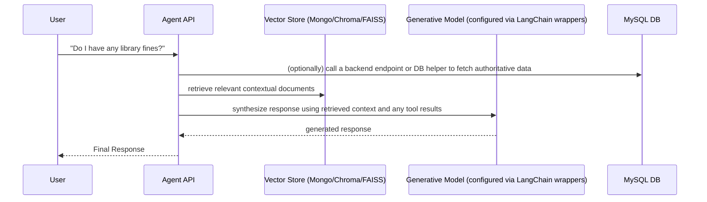
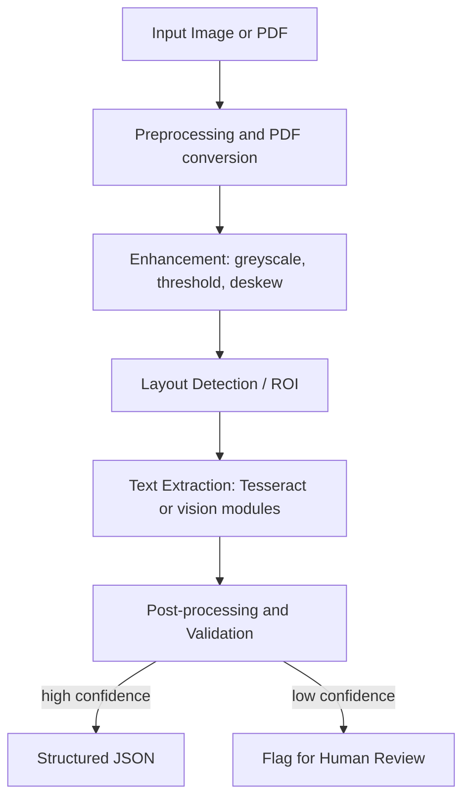

## AI & Machine Learning Documentation

### 1. Agent1 (the implemented Agent)
`Agent1` is implemented as a FastAPI application (see `Agent1/api/app.py`). It provides routes for chat, document ingestion, diagnostics, and RAG debugging. The service uses MongoDB for conversational storage/vector metadata and supports multiple embedding/vector backends (Chroma, FAISS, etc.) depending on configuration.

Key implementation notes:
- The app factory is in `Agent1/api/app.py` and is started by `start_servers.bat` using `uvicorn api.app:app`.
- Embeddings are created via HuggingFace/`langchain` helpers (see `Agent1/memory/vector/*` and `Agent1/tools/documents/embeddings.py`). The embedding dimensionality depends on the chosen model and is not hard-coded in the repo docs.

### RAG / Tooling (prototype flow)
A high-level flow used by the Agent in this codebase:

---

### 2. Doc OC (Optical Character Recognition)
The `backend-ocr` service contains the OCR pipeline. The main entrypoint is `backend-ocr/main.py`, which loads preprocessing modules and pipeline code from `pipeline.py` and `scripts/`.

Processing overview (implemented):

Key implementation references:
- `backend-ocr/main.py` — FastAPI endpoints: `/process`, `/submit_marksheets`, admin endpoints, and DB insert logic.
- `backend-ocr/scripts/` — helper scripts for board-specific extraction (e.g., `college_extractor.py`).

---

### 3. Future / Planned AI work
The repo contains notes about future ideas such as a student performance predictor or face-recognition attendance. Those are marked as planned; they are not present as production-ready modules in the current source tree.
