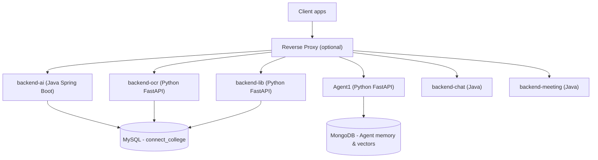
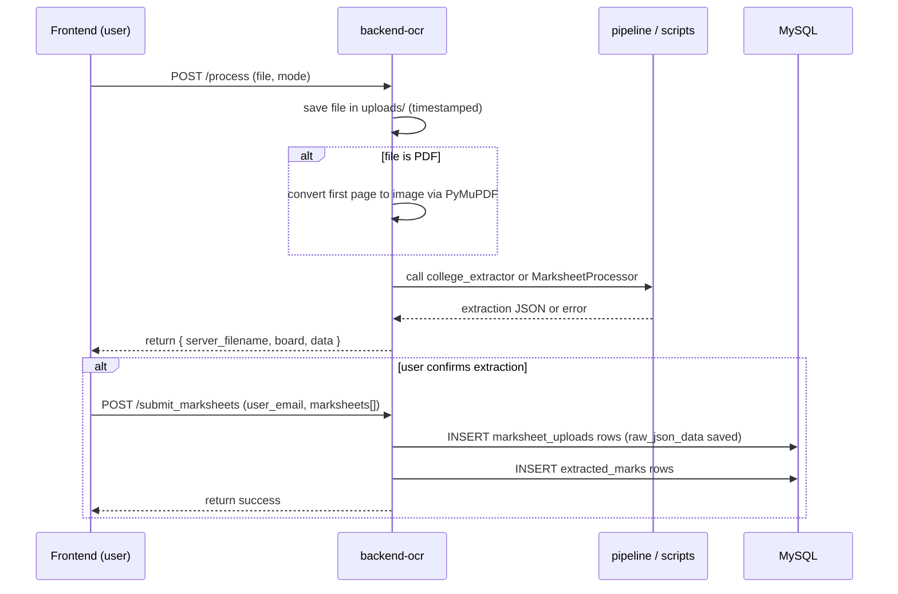
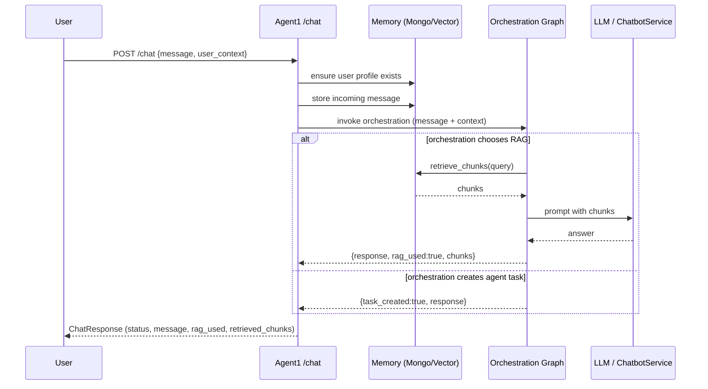
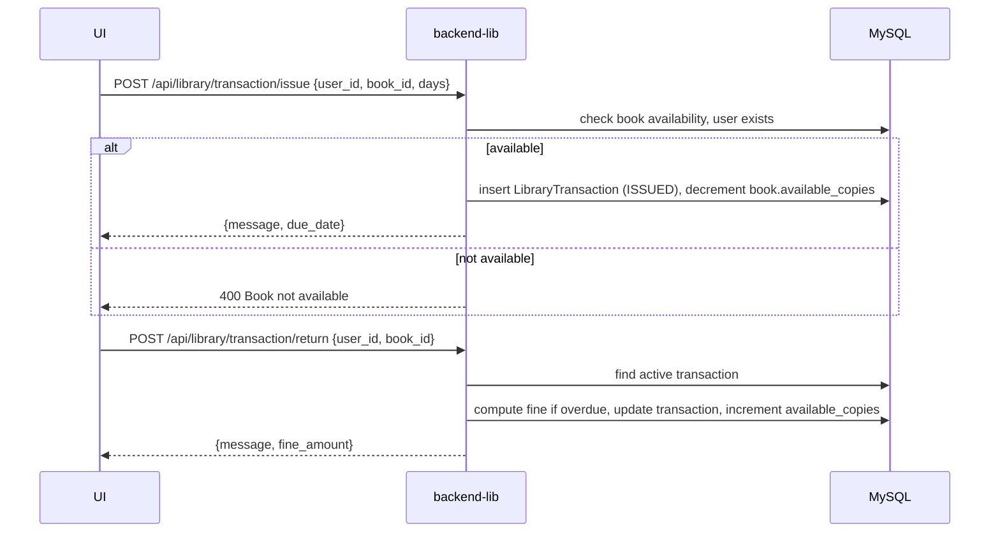
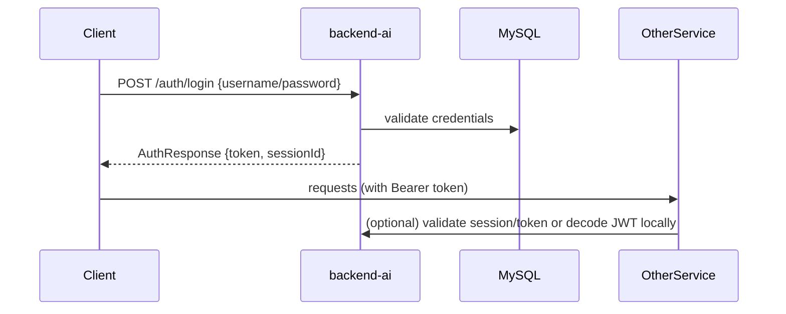
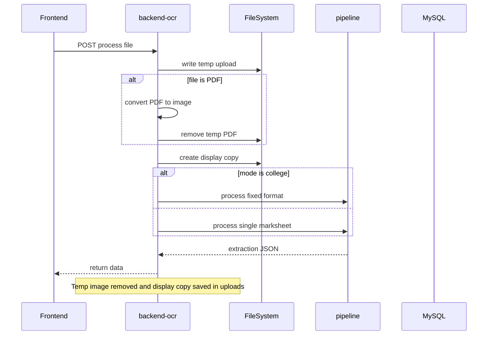
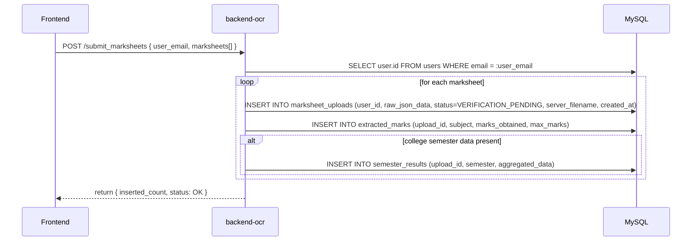
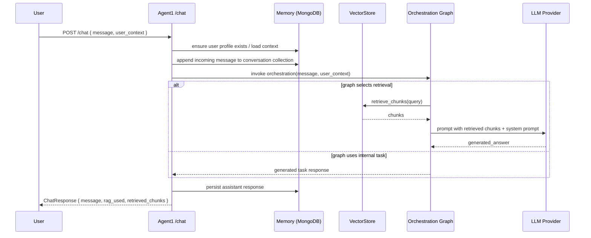
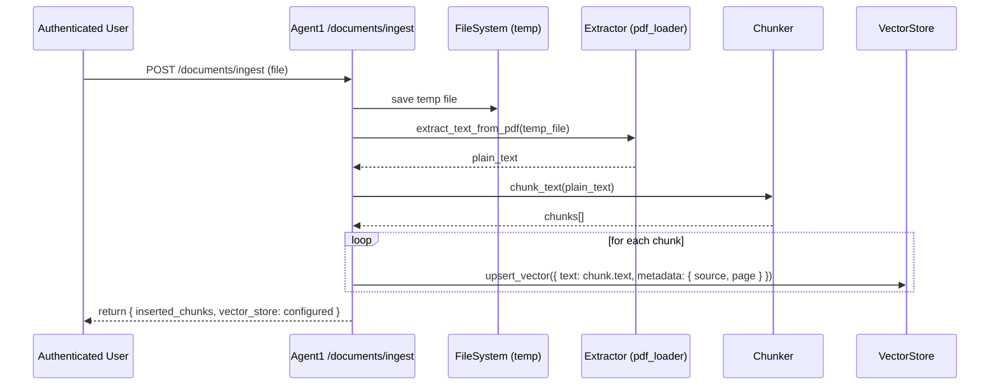
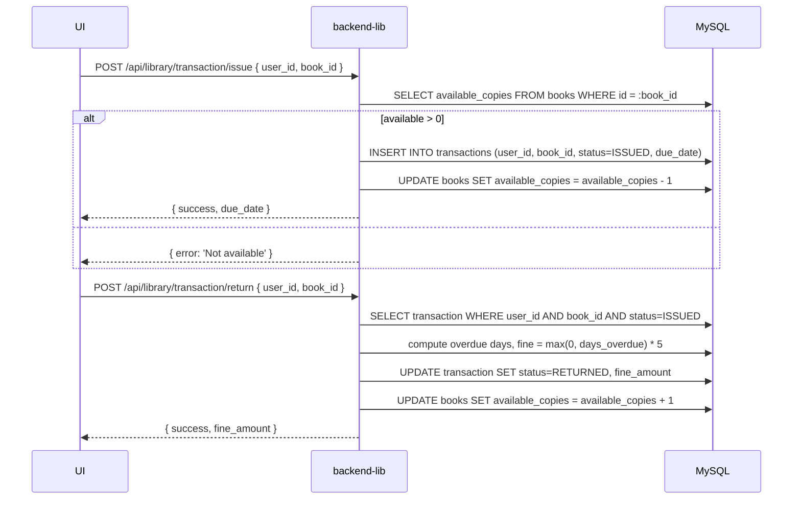

# ARCHITECTURE_CURRENT

Purpose
- This file documents only the currently implemented architecture and code in this repository. It lists every service, every route implemented in the codebase, the exact request/response shapes and side-effects, and the internal data flow for each feature. It does NOT include future or proposed changes.

Scope
- Services covered: `backend-ocr`, `Agent1`, `backend-lib`, `backend-ai`, `backend-chat`, `backend-meeting` and repository-level helpers (`start_servers.bat`, `database/`).

---

## Summary map (single-line)
- `backend-ocr/` — FastAPI marksheet OCR service and persistence logic (`backend-ocr/main.py`).
- `Agent1/` — FastAPI Agent API (chat, ingestion, diagnostics, RAG debug); memory & vector backends under `Agent1/memory`.
- `backend-lib/` — FastAPI Library Management service (SQLAlchemy models & routers in `backend-lib/routers/library.py`).
- `backend-ai/`, `backend-chat/`, `backend-meeting/` — Java (Spring Boot) services. Key controllers with route prefixes are present under `src/main/java/.../controller`.
- `database/` — SQL schema files (e.g., `connect_college_schema.sql`) used by `backend-ocr` and Java services.
- `start_servers.bat` — local orchestration wrapper that launches mvnw/uvicorn/python for services.

---

## Service: backend-ocr (code: `backend-ocr/main.py`)

Purpose
- Handle uploaded marksheets (image or PDF), run OCR preprocessing and extraction, present structured results for user review, and persist verified marksheets and normalized marks into MySQL tables.

Important files referenced
- `backend-ocr/main.py` — FastAPI app and all endpoints.
- `backend-ocr/pipeline.py` — Marksheet pipeline class (`MarksheetProcessor`) loaded at startup (if present).
- `backend-ocr/scripts/` — helper extractors such as `college_extractor.py` for fixed-format college marksheets.

Global runtime behavior
- On startup, `main.py` attempts to load `pipeline.py` and auxiliary scripts; if missing, endpoints that depend on them will return HTTP 500 with init errors.
- Uses a MySQL connection pool (pool name `ocr_pool`), configured in `main.py` via `DB_CONFIG`.
- Creates and serves `uploads/` directory via `StaticFiles` at `/uploads` for display copies.

Endpoints (exact paths and behavior)

- `GET /`
  - Response: JSON {"message": "DOC OC API is running", "status": "ok"}

- `POST /process`
  - Content-type: multipart/form-data
  - Parameters:
    - `file` (UploadFile) — required; image or PDF
    - query `mode` (string) — optional; default `school`; supported value `college` triggers college-specific extractor
    - query `expected_sem` (string) — optional; when provided in `college` mode, compares extracted semester and returns 400 if mismatch
  - Behavior:
    - Saves uploaded file to `uploads/` with sanitized timestamped filename.
    - If file is `.pdf`, converts first page to a 300 DPI JPEG via PyMuPDF (if available); original temporary PDF is removed.
    - Creates a display copy named `<stem>_display<ext>` kept under `uploads/` and returned to caller.
    - If `mode == "college"`, imports and calls `scripts.college_extractor.process_fixed_format(str(temp_path), info_box, marks_box)` and returns a JSON structure: `{ "board": "COLLEGE_FIXED", "data": <dict>, "server_filename": <display_filename> }`. If `expected_sem` supplied and mismatch detected returns 400 with an error JSON describing semester mismatch.
    - Else uses `MarksheetProcessor.process_single_marksheet(str(temp_path))` to run the generic pipeline. If `result['extraction']` contains `data` or points to `final_json`, loads and returns it; otherwise returns a `data` object describing the failure and `server_filename`.
  - Return: JSON with at least `server_filename`, `board` (detected), and `data` (structured extraction or failure note).
  - Side effects: temporary image removed in `finally`; display copy remains.

- `POST /create_user`
# ARCHITECTURE_CURRENT.md

Purpose
- Document the currently implemented architecture and code in this repository. Includes every service, implemented route and handler, precise request/response shapes, side-effects, and internal data flow. Future/proposed changes are excluded and placed in `Md file/FUTURE_ARCHITECTURE.md`.

Scope
- The document covers: `backend-ocr`, `Agent1`, `backend-lib`, `backend-ai`, `backend-chat`, `backend-meeting`, `database/`, and orchestration helpers.

---

## High-level component map

---

## `backend-ocr` — OCR pipeline (file: `backend-ocr/main.py`)

Purpose
- Accept marksheet uploads (image / PDF), run preprocessing and OCR extraction, provide reviewable JSON, and persist verified data to the relational DB.

Key files
- `backend-ocr/main.py` — FastAPI app with all endpoints.
- `backend-ocr/pipeline.py` — `MarksheetProcessor` (dynamically loaded).
- `backend-ocr/scripts/` — board-specific extractors (`college_extractor.py`).

Process flow (detailed sequence)

Implemented endpoints (exact behavior)
- `GET /` — returns a health JSON with message and status.
- `POST /process` — multipart file upload plus query `mode` (default `school`) and optional `expected_sem`:
  - Saves file to `uploads/`, converts PDF -> image if required, creates a `_display` copy, and delegates to `scripts.college_extractor` (college mode) or `MarksheetProcessor.process_single_marksheet` (default) to extract structured data.
  - Returns JSON containing `server_filename`, `board` (detected), and `data` (extraction or failure note).
- `POST /submit_marksheets` — accepts body `{ user_email, marksheets: [ { filename, data, ... } ] }`:
  - Resolves `user_id` from `user_email`.
  - Inserts `marksheet_uploads` row for each file with `raw_json_data` and status `VERIFICATION_PENDING`.
  - Inserts `extracted_marks` rows per subject. For college marksheets inserts `semester_results` where present.
  - Returns commit result and saved count.
- Admin/student management endpoints: `GET /api/admin/marksheets/pending`, `POST /api/admin/marksheets/{upload_id}/verify`, `GET /api/admin/marksheets/history`, `POST /api/student/request`, `GET /api/admin/requests/pending`, `POST /api/admin/requests/{upload_id}/handle` — these perform queries and updates on `marksheet_uploads` and related tables; see source for SQL field lists.

Database tables used (as in code): `marksheet_uploads`, `extracted_marks`, `semester_results`.

---

## `Agent1` — Chat agent and RAG tooling (files under `Agent1/api/*`)

Purpose
- Host an agent service that stores conversational context, runs retrieval on vector stores, orchestrates LLM calls via an orchestration graph, and ingests documents into a vector DB.

App wiring
- `Agent1/api/app.py` constructs the FastAPI app, creates a shared `memory` provider (`MongoClientProvider`) and injects it into route modules using `set_memory_backend(memory)`.

Routes and exact behaviors
- Mounted routers:
  - `/chat` — `Agent1/api/routes/chat.py`
  - `/documents` — `Agent1/api/routes/ingest.py`
  - `/diagnostics` — `Agent1/api/routes/diagnostics.py`
  - `/rag` — `Agent1/api/routes/rag_debug.py`

Chat endpoint flow

`POST /documents/ingest` (ingest flow)
- Requires authenticated user with role in `{ADMIN, MODERATOR, FACULTY}`.
- Saves uploaded PDF to temporary file, extracts text via `utils.pdf_loader.extract_text_from_pdf`, chunks with `utils.chunking.chunk_text`, and stores chunks in the configured vector store via `Agent1/memory/vector/*`.

Diagnostics & debugging
- `GET /diagnostics/health` — returns runtime status including `mongo_connected` (via `memory.ping()`), configured `vector_db` and `llm_provider` setting.
- `POST /rag/debug` — returns raw retrieval chunks for a query using `ChatbotService.retrieve_chunks`.

Auth helpers
- `Agent1/api/middleware/auth.py` exposes `extract_user_context` (strict) and `get_optional_user_context` (optional) that decode JWTs using `settings.jwt_secret` and return `UserContext` objects.

Memory & embeddings (implemented)
- `Agent1/memory/vector/chroma.py` and `faiss_store.py` implement vector store adapters. Embeddings are created using `HuggingFaceEmbeddings` via `langchain_community.embeddings` and are configurable in `Agent1/config`.

---

## `backend-lib` — Library Management (files: `backend-lib/main.py`, `backend-lib/routers/library.py`)

Purpose
- Catalog books, issue/return transactions, compute fines, and provide administrative stats.

Core flows (diagrams)

Implemented endpoints
- `GET /api/library/books`, `POST /api/library/books`, `POST /api/library/transaction/issue`, `POST /api/library/transaction/return`, `GET /api/library/student/my-books`, `GET /api/library/stats`, `GET /api/library/admin/overdue`.

---

## `backend-ai`, `backend-chat`, `backend-meeting` (Java)

Purpose
- Java Spring Boot modules providing authentication/session management (`backend-ai`), chat REST endpoints and real-time messaging (`backend-chat`), and meeting scheduling/signaling (`backend-meeting`).

Auth/session concise flow (from `AuthController`)

Representative chat endpoints (see `backend-chat` source): `/api/users`, `/api/rooms`, `/api/history/*`, `/api/groups/*`.

---

## Repo orchestration & data

- `start_servers.bat` starts/controls services locally; it checks MongoDB and launches Java and Python services in separate terminals.
- `database/connect_college_schema.sql` provides the relational schema used by `backend-ocr` and Java services.
- `uploads/` in `backend-ocr` stores display images created during processing.

---

## Next steps for me (pick one)
- (A) Add per-endpoint inline sequence diagrams for `/process`, `/submit_marksheets`, chat flow, ingest flow and library issue/return (if you pick this I will add more granular steps and DB column mappings).
- (B) Run a line-by-line consistency pass producing source file links with line ranges for every documented route.

Reply with `A` or `B` to continue.

## Source file locations (route → source link)

- backend-ocr
  - GET `/` : [backend-ocr/main.py](backend-ocr/main.py#L147)
  - POST `/process` : [backend-ocr/main.py](backend-ocr/main.py#L151-L152)
  - handler `process_marksheet` : [backend-ocr/main.py](backend-ocr/main.py#L152-L165)
  - POST `/create_user` : [backend-ocr/main.py](backend-ocr/main.py#L268-L269)
  - GET `/user/{email}` : [backend-ocr/main.py](backend-ocr/main.py#L297-L298)
  - POST `/submit_marksheets` : [backend-ocr/main.py](backend-ocr/main.py#L317-L318)
  - GET `/user_marksheets/{email}` : [backend-ocr/main.py](backend-ocr/main.py#L465-L466)
  - GET `/api/admin/marksheets/pending` : [backend-ocr/main.py](backend-ocr/main.py#L520)
  - POST `/api/admin/marksheets/{upload_id}/verify` : [backend-ocr/main.py](backend-ocr/main.py#L547)
  - GET `/api/admin/marksheets/history` : [backend-ocr/main.py](backend-ocr/main.py#L569)
  - POST `/api/student/request` : [backend-ocr/main.py](backend-ocr/main.py#L602)
  - GET `/api/admin/requests/pending` : [backend-ocr/main.py](backend-ocr/main.py#L647)
  - POST `/api/admin/requests/{upload_id}/handle` : [backend-ocr/main.py](backend-ocr/main.py#L667)

- Agent1
  - POST `/chat/` : [Agent1/api/routes/chat.py](Agent1/api/routes/chat.py#L57)
  - POST `/documents/ingest` : [Agent1/api/routes/ingest.py](Agent1/api/routes/ingest.py#L21)
  - GET `/diagnostics/health` : [Agent1/api/routes/diagnostics.py](Agent1/api/routes/diagnostics.py#L17)
  - POST `/rag/debug` : [Agent1/api/routes/rag_debug.py](Agent1/api/routes/rag_debug.py#L28)
  - Auth middleware helpers (`extract_user_context`, `get_optional_user_context`) : [Agent1/api/middleware/auth.py](Agent1/api/middleware/auth.py#L1)

- backend-lib
  - app root `GET /` : [backend-lib/main.py](backend-lib/main.py#L21)
  - GET `/api/library/books` : [backend-lib/routers/library.py](backend-lib/routers/library.py#L20)
  - POST `/api/library/books` : [backend-lib/routers/library.py](backend-lib/routers/library.py#L29)
  - POST `/api/library/transaction/issue` : [backend-lib/routers/library.py](backend-lib/routers/library.py#L39)
  - POST `/api/library/transaction/return` : [backend-lib/routers/library.py](backend-lib/routers/library.py#L68)
  - GET `/api/library/student/my-books` : [backend-lib/routers/library.py](backend-lib/routers/library.py#L113)
  - GET `/api/library/stats` : [backend-lib/routers/library.py](backend-lib/routers/library.py#L123)
  - GET `/api/library/admin/overdue` : [backend-lib/routers/library.py](backend-lib/routers/library.py#L144)

- Java services (representative controllers)
  - `AuthController` (auth/session endpoints) : [backend-ai/src/main/java](backend-ai/src/main/java) (see controller class under `controller/AuthController.java`)
  - `ResourceController` (chat endpoints) : [backend-chat/src/main/java](backend-chat/src/main/java) (see `controller/ResourceController.java`)

If you'd like, I can expand each link to exact method line ranges inside the Java controller files and add per-endpoint sequence diagrams next.

## Per-endpoint sequence diagrams (detailed)

### `POST /process` (backend-ocr)

### `POST /submit_marksheets` (backend-ocr)

### `POST /chat` (Agent1)

### `POST /documents/ingest` (Agent1)

### Library issue / return (backend-lib)

