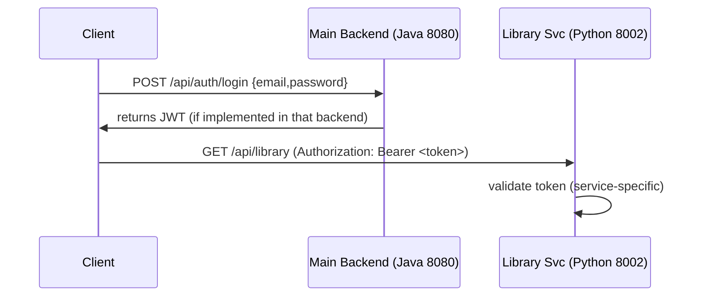

# Core Backend Documentation

## 1. Services & Technologies (implemented)
The repository contains multiple services. The following table documents what is present and how the prototype is run locally.

| Service | Port (start_servers.bat) | Language | Framework | Location / Responsibility |
| :--- | :---: | :--- | :--- | :--- |
| Main Core | `8080` | Java | Spring Boot (mvnw) | `backend-ai/` – core business logic and identity (Java project)
| OCR Engine | `8000` | Python | FastAPI | `backend-ocr/` – marksheet OCR pipeline and persistence (see `backend-ocr/main.py`)
| AI Agent | `8010` | Python | FastAPI | `Agent1/` – Agent API and RAG helpers (app in `Agent1/api/app.py`)
| Library Service | `8002` | Python | FastAPI | `backend-lib/` – library inventory and mobile scanner bridge
| Chat Service | `8083` | Java | Spring Boot (mvnw) | `backend-chat/` – messaging / signaling
| Meeting Service | `8082` | Java | Spring Boot (mvnw) | `backend-meeting/` – meeting scheduling / signaling

Notes:
- The `start_servers.bat` script in the repository root invokes `mvnw` for Java services and `uvicorn` / `python` for Python services. See `start_servers.bat` for the exact commands used to start each service locally.

---

## 2. Authentication & Security (what the repo contains)
The codebase includes JWT-related helpers/tests in `Agent1` and the general design uses JWT for stateless auth between client and services in this prototype. Concrete authentication endpoints and token signing live in the Java backend (where implemented) or are validated in a service-by-service manner; inspect each service for its auth implementation.

### Example sequence (prototype flow)

---

## 3. API Highlights (implemented endpoints)

### OCR Service (`backend-ocr`)
Base URL: `http://localhost:8000` (when started via `start_servers.bat`)

- `POST /process` — Accepts uploaded image/PDF, runs preprocessing and OCR, returns structured JSON for review. Implemented in `backend-ocr/main.py`.
- `POST /submit_marksheets` — Persists user-confirmed extraction into MySQL tables (e.g., `marksheet_uploads`, `extracted_marks`). See `backend-ocr/main.py` for full payload and insertion logic.

### Library Service (`backend-lib`)
Base URL: `http://localhost:8002`

- `POST /api/library/transactions/issue` — Example endpoint implemented in `backend-lib/routers/library.py` to handle issuing books and inventory checks.

Refer to the source files in each service for the complete and authoritative API surface.

---

## 4. Error Handling
Each service implements JSON error responses. Common patterns used in the codebase include returning HTTP error codes with JSON bodies containing `error` or `detail` fields. Refer to each service's router code for exact shapes.

---

## 5. Development Guidelines (local)
- Use the ports and start commands in `start_servers.bat` when running locally.
- Prefer environment variables for configuration where present. Some services have DB credentials in their local config files for prototype convenience; treat those as development-only.
- Logging in Python services uses standard `logging` (see `backend-ocr/main.py`); Java services use Spring Boot logging.

---

Note: Items such as Redis caching, Kubernetes deployment, Vault integration, or on-prem LLM hosting are discussed elsewhere in the repository as potential future steps. This document avoids asserting those features are implemented unless referenced by source code files.
