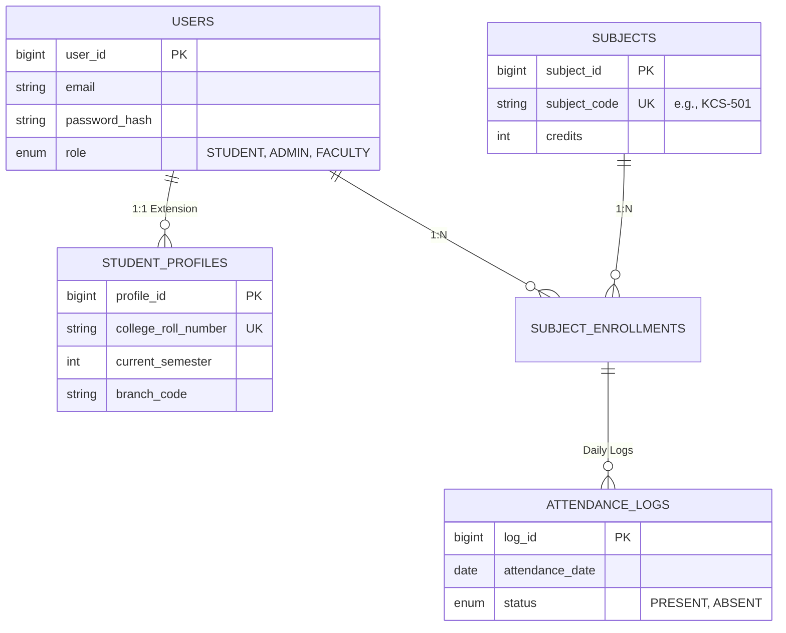
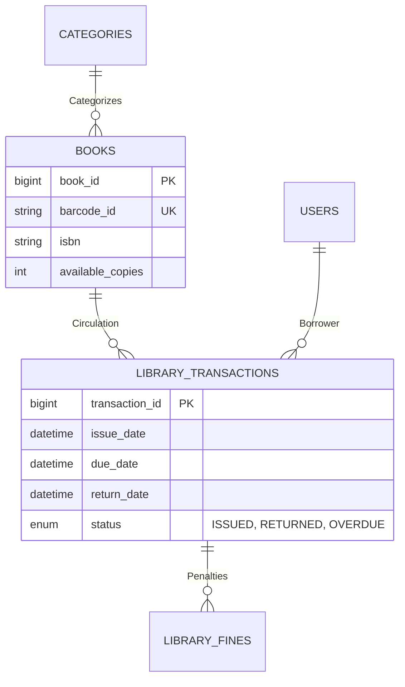

# Database Documentation & Schema Design

## 1. Relational Database (MySQL)
The system uses a normalized relational schema (`connect_college`) optimized for complex joins involved in academic reporting.

### A. Entity-Relationship Diagrams (ERD)

#### Module 1: Academic & Identity
This diagram focuses on the core user data and their academic progression.



#### Module 2: Smart Library
Tracks the physical movement of assets.



### B. Data Dictionary (Key Tables)

#### `marksheet_uploads`
Stores the metadata of every file processed by the OCR engine.
| Column | Type | Description |
| :--- | :--- | :--- |
| `upload_id` | `BIGINT (PK)` | Unique identifier. |
| `user_id` | `BIGINT (FK)` | Owner of the document. |
| `status` | `ENUM` | `PROCESSING`, `VERIFICATION_PENDING`, `APPROVED`, `REJECTED`. |
| `raw_json_data` | `JSON` | Complete output from the OCR pipeline (archived for auditing). |
| `confidence_score` | `FLOAT` | Average confidence of the extraction (0.0 to 1.0). |

#### `extracted_marks`
Normalized data parsed from the `raw_json_data`.
| Column | Type | Description |
| :--- | :--- | :--- |
| `mark_id` | `BIGINT (PK)` | Unique identifier. |
| `upload_id` | `BIGINT (FK)` | Link to parent upload. |
| `subject_code` | `VARCHAR` | The standard code (e.g., "KCS-502") used for mapping to `subjects`. |
| `marks_obtained` | `FLOAT` | Total marks achieved. |
| `grade` | `VARCHAR` | Letter grade (A+, B, F) if available. |

---

## 2. NoSQL Database (MongoDB)
Used by `Agent1` for flexible, high-volume data storage.

### Collections

#### `chat_history`
Maintains conversational context for the AI.
```json
{
  "_id": "ObjectId('...')",
  "session_id": "uuid-v4",
  "user_id": 105,
  "messages": [
    { "role": "user", "content": "What is my attendance in OS?", "timestamp": "..." },
    { "role": "assistant", "content": "Your attendance in Operating Systems is 78%.", "timestamp": "..." }
  ]
}
```

#### `rag_documents`
Vector store for RAG (Retrieval Augmented Generation).
```json
{
  "_id": "ObjectId('...')",
  "doc_type": "NOTICE",
  "content": "Holiday declared on 15th Aug...",
  "embedding": [0.12, -0.45, 0.88, ...],
  "metadata": {
    "source": "admin_announcement",
    "date": "2023-08-10"
  }
}
```

Note: the repository includes vector embedding helpers (Agent1) and supports multiple backends (Mongo/Chroma/FAISS) depending on runtime configuration. The exact dimensionality depends on the chosen embedding model and is not hard-coded in the schema.
