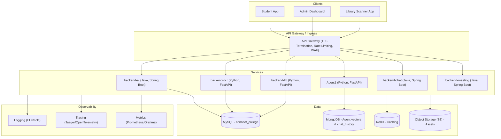
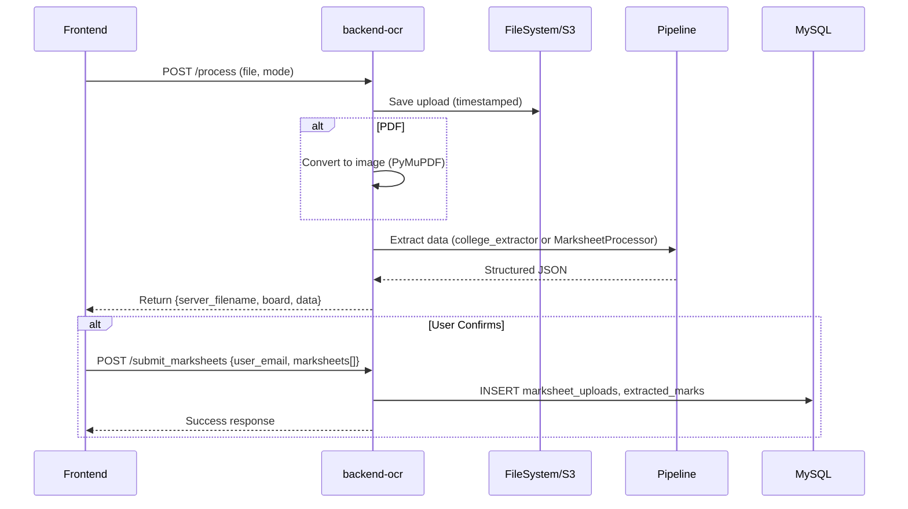
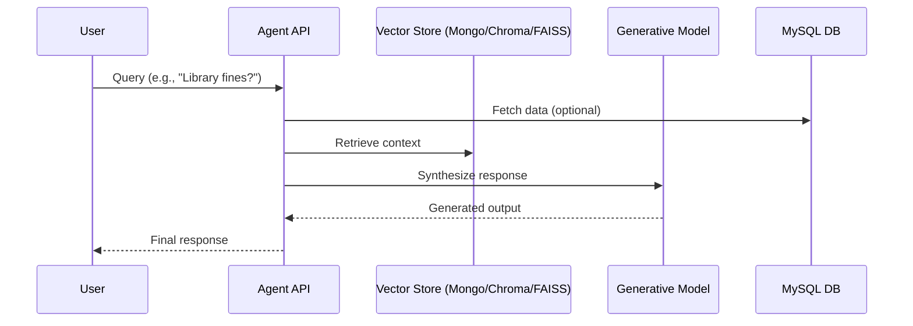
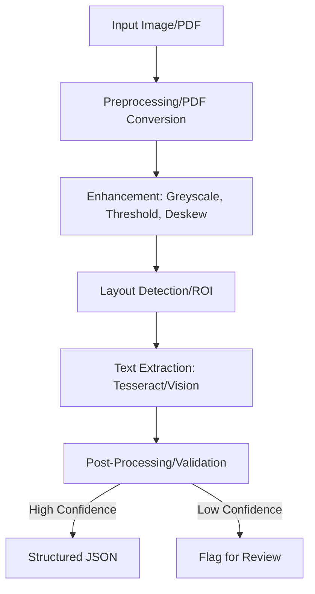
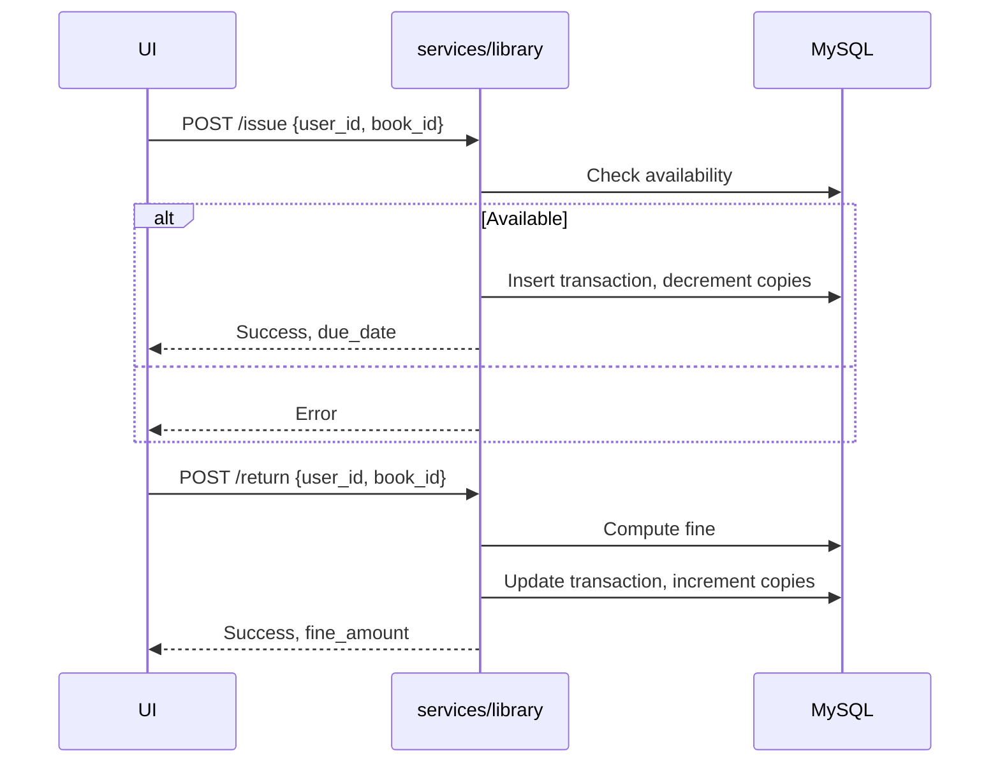
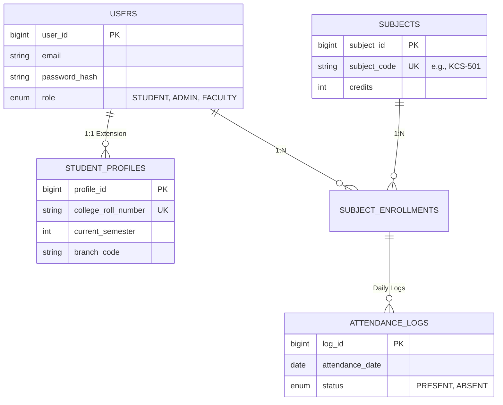
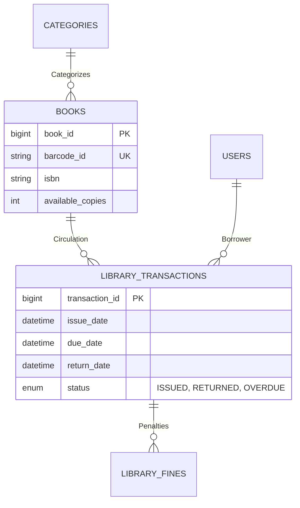
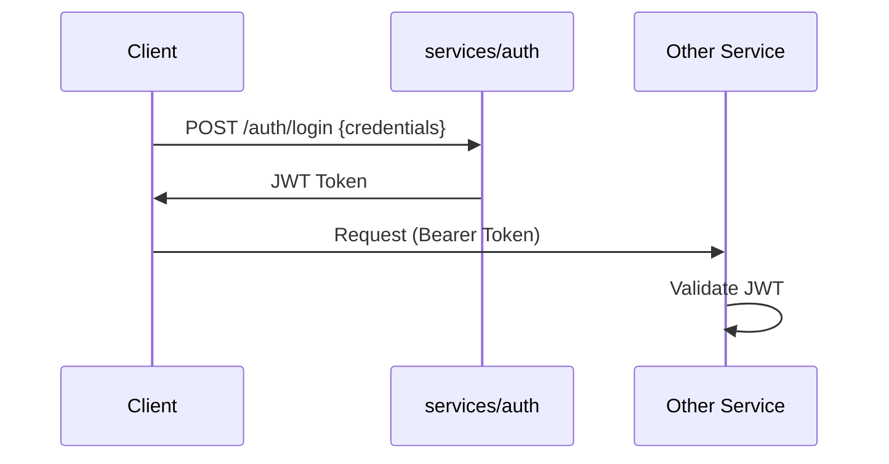

# CampusIntel

[](https://youtu.be/RIfFyF_utRg)

A comprehensive, multi-service prototype for campus automation and AI-assisted tooling. This repository implements document OCR processing, an AI conversational agent with RAG capabilities, library management APIs, and backend services for core business logic, chat, and meetings. Built with a mix of Python and Java technologies, it focuses on scalability, security, and integration for educational environments.

## Table of Contents

- [CampusIntel](#campusintel)
  - [Table of Contents](#table-of-contents)
  - [Project Overview](#project-overview)
  - [Features](#features)
  - [System Architecture](#system-architecture)
    - [High-Level Architecture](#high-level-architecture)
    - [Data Flow Example: Marksheet Verification](#data-flow-example-marksheet-verification)
  - [Core Components](#core-components)
    - [AI and Machine Learning](#ai-and-machine-learning)
      - [RAG Flow](#rag-flow)
    - [OCR Processing](#ocr-processing)
      - [Processing Flow](#processing-flow)
    - [Library Management](#library-management)
      - [Transaction Flow](#transaction-flow)
    - [Backend Services](#backend-services)
  - [Database Design](#database-design)
    - [Relational (MySQL: connect\_college)](#relational-mysql-connect_college)
      - [ERD: Academic \& Identity](#erd-academic--identity)
      - [ERD: Smart Library](#erd-smart-library)
    - [NoSQL (MongoDB)](#nosql-mongodb)
  - [Deployment and Orchestration](#deployment-and-orchestration)
  - [Security and Authentication](#security-and-authentication)
  - [Setup Guide](#setup-guide)
    - [Prerequisites](#prerequisites)
    - [Clone Repository](#clone-repository)
    - [Database Setup](#database-setup)
    - [Configuration](#configuration)
    - [Install Dependencies](#install-dependencies)
    - [Run](#run)
  - [Usage](#usage)
  - [Development Guidelines](#development-guidelines)
  - [Troubleshooting](#troubleshooting)
  - [Contributing](#contributing)

## Project Overview

Unified Campus Intelligence is a prototype system designed to automate campus operations through AI-driven tools. Key implemented components include:

- **Document OCR**: Processes marksheets and extracts structured data for verification and storage.
- **AI Agent**: A conversational assistant using Retrieval-Augmented Generation (RAG) for context-aware responses.
- **Library Management**: Handles book inventory, transactions, and fines.
- **Social Modules**: Java-based services for authentication, chat, and meeting scheduling.

This repository reflects the fully implemented prototype. All features are sourced from the codebase; no unimplemented proposals are claimed.

**Quick Links**:
- [Demo Video](https://youtu.be/RIfFyF_utRg)
- [Core Backend Documentation](./CORE_BACKEND.md)
- [Database Schema](./DATABASE.md)
- [AI Documentation](./AI_SECTION.md)

## Features

- **Marksheet Verification**: Upload images/PDFs, extract data via OCR, review, and persist to database with admin approval workflows.
- **AI Assistant**: Handles queries with conversational memory, vector-based retrieval, and integration with backend data sources.
- **Library System**: Book cataloging, issuing/returning, fine calculations, and stats for admins/students.
- **Chat and Meetings**: Real-time messaging and scheduling with signaling support.
- **Scalable Deployment**: Containerized services with Kubernetes support, caching via Redis, and secrets management.
- **Observability**: Integrated logging, tracing, and metrics for monitoring.
- **Security**: JWT-based authentication, rate limiting, and least-privilege access.

## System Architecture

The system follows a microservices architecture with HTTP/REST endpoints, supported by relational and NoSQL databases. Services are containerized using Docker and orchestrated via Kubernetes for scalability.

### High-Level Architecture



### Data Flow Example: Marksheet Verification

1. User uploads marksheet to `/process` endpoint.
2. OCR service preprocesses, extracts data, and returns JSON for review.
3. Upon confirmation, data is persisted to MySQL tables.
4. Admin reviews and approves/rejects via dedicated endpoints.



- **Agent1**: AI agent API and memory management (`services/agent`).
- **services/ocr**: OCR service entrypoint (`main.py`).
- **Java Services**: Use Maven wrappers (`mvnw`) for building/running.

## Core Components

### AI and Machine Learning

**`services/agent`**: A FastAPI-based AI assistant with RAG support. Uses MongoDB for vectors and chat history. Embeddings via HuggingFace/LangChain.

#### RAG Flow



- Endpoints: `/chat`, `/documents/ingest`, `/diagnostics/health`, `/rag/debug`.
- Supports GPU inference and quantized LLMs for efficiency.

### OCR Processing

Implemented in `services/ocr`. Handles image/PDF uploads, preprocessing, and extraction.

#### Processing Flow



- Key Endpoints: `POST /process`, `POST /submit_marksheets`, admin routes for verification.

### Library Management

`services/library`: FastAPI service for book transactions and stats.

#### Transaction Flow



- Endpoints: `/api/library/books`, `/api/library/transaction/issue`, etc.

### Backend Services

| Service | Port | Language/Framework | Responsibility |
|---------|------|---------------------|---------------|
| services/auth | 8080 | Java/Spring Boot | Core logic, identity |
| services/ocr | 8000 | Python/FastAPI | OCR and persistence |
| services/agent | 8010 | Python/FastAPI | AI agent |
| services/library | 8002 | Python/FastAPI | Library management |
| services/chat | 8083 | Java/Spring Boot | Messaging |
| services/meeting | 8082 | Java/Spring Boot | Meetings |

## Database Design

### Relational (MySQL: connect_college)

Normalized schema for academic and library data.

#### ERD: Academic & Identity



#### ERD: Smart Library



Key Tables: `marksheet_uploads`, `extracted_marks` (see full schema in `database/connect_college_schema.sql`).

### NoSQL (MongoDB)

Collections: `chat_history` (conversations), `rag_documents` (vectors with embeddings).

## Deployment and Orchestration

- **Containerization**: Docker images per service.
- **Orchestration**: Kubernetes manifests/Helm charts for deployments, autoscaling, and services.
- **Caching**: Redis for high-read endpoints.
- **Storage**: S3-compatible for assets.
- **Secrets**: HashiCorp Vault or KMS for dynamic credentials.
- **Observability**: ELK/Loki for logs, OpenTelemetry/Jaeger for traces, Prometheus/Grafana for metrics and SLOs.

## Security and Authentication

JWT-based stateless auth. Example flow:



- Hardened with rate limiting, WAF, and IAM roles.

## Setup Guide

For a fresh Windows PC:

### Prerequisites

- Git: [Download](https://git-scm.com/download/win)
- Java JDK 17+: [Download](https://adoptium.net/temurin/releases/)
- Python 3.10+: [Download](https://www.python.org/downloads/)
- Node.js 18+: [Download](https://nodejs.org/)
- MySQL 8.0: [Download](https://dev.mysql.com/downloads/installer/)
- MongoDB 7.0: [Download](https://www.mongodb.com/try/download/community)
- VS Code: [Download](https://code.visualstudio.com/)

Install with defaults; ensure PATH additions for Java/Python/Node.

### Clone Repository

```bash
git clone <REPO_URL>
cd FINAL-ASSEMBLY
```

### Database Setup

- MySQL: Create `connect_college` and import `database/connect_college_schema.sql`.
- MongoDB: Ensure service is running (`net start MongoDB`).

### Configuration

Copy and edit `.example` files in respective directories (e.g., `application.yml`, `.env`) with passwords/API keys.

### Install Dependencies

Run scripts or manually:

- Python: `pip install -r requirements.txt` in services/agent, services/ocr, services/library.
- Node: `npm install` in apps/landing and apps/web.

### Run

- Servers: `scripts\start_all.bat` (Windows) or `scripts/start_all.sh` (Linux/Mac)
- Frontends: `npm run dev` in respective dirs (`apps/web`, `apps/landing`).

Access: Landing at http://localhost:5173, Web at http://localhost:5174.

## Usage

- Upload marksheets via OCR endpoints.
- Query AI agent at `/chat`.
- Manage library via `/api/library/*`.
- Use admin dashboards for approvals.

## Development Guidelines

- Use `scripts/start_all` for local runs.
- Environment vars for configs.
- Structured logging in services.

## Troubleshooting

- "Command not recognized": Check PATH.
- Connection issues: Verify services running, passwords match.
- Port conflicts: Kill processes with `taskkill`.

## Contributing

Fork, create branch, PR with changes. Follow code style in existing files.