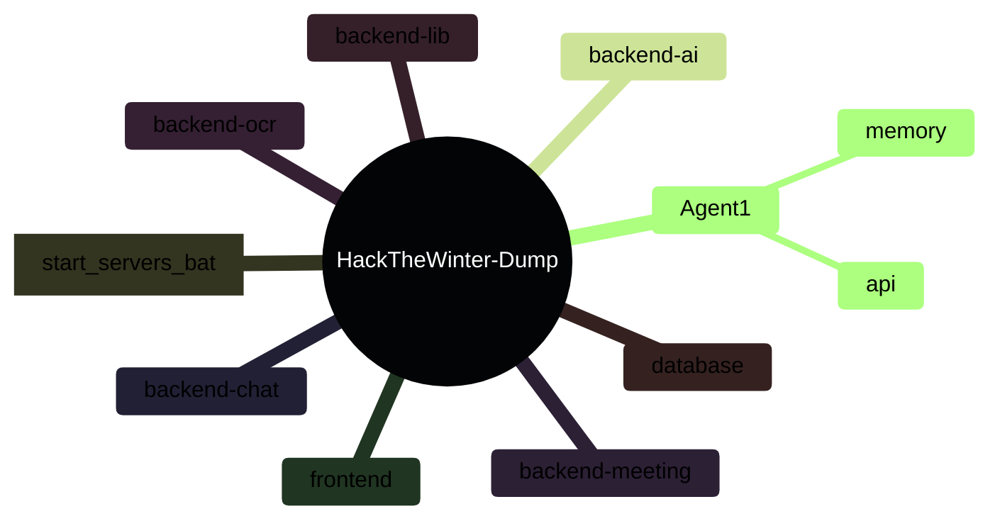
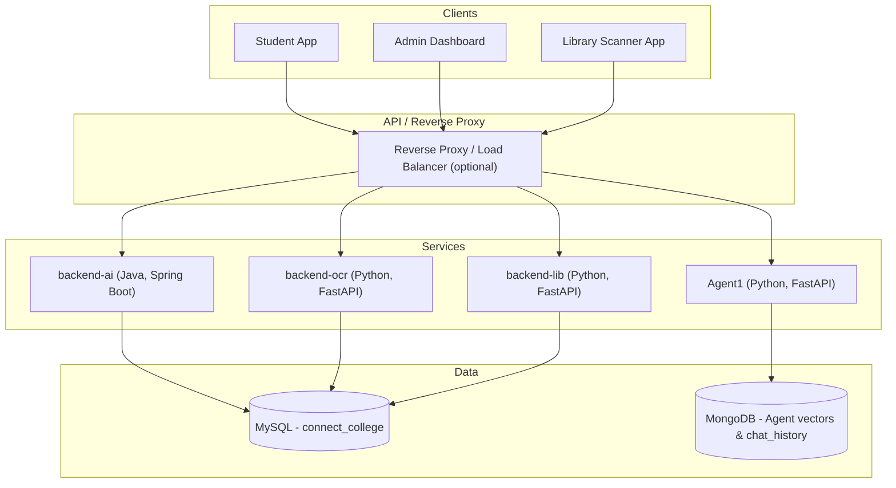

# Unified Campus Intelligence — Project Overview

## 1. Executive Summary
This repository is a multi-service prototype for campus automation and assistant tooling. The implemented components are focused on document OCR processing, an AI assistant (Agent1) that uses RAG-style lookup, and smaller services such as a library management API and several Java-based backend modules. The documentation in this folder reflects what is implemented in the codebase; any production features mentioned in the roadmap are proposals only and are not implemented in source.

**Quick Links**:
- [Demo Video](https://youtu.be/RIfFyF_utRg)
- [Core Backend Architecture](./CORE_BACKEND.md)
- [Database Schema](./DATABASE.md)
- [AI & Intelligence](./AI_SECTION.md)

---

## 2. Directory Structure (implemented services)
This is the current layout and which component lives where in the repository:



Notes:
- The Agent API application is created in `Agent1/api/app.py` and served with `uvicorn api.app:app` in `start_servers.bat`.
- The OCR service entrypoint is `backend-ocr/main.py` (FastAPI).
- Java services use `mvnw` wrappers in each Java subproject.

---

## 3. System Architecture & Data Flow (implemented)

The diagrams in this repo provide a simplified view of how implemented services interact. They describe the current prototype: HTTP/REST endpoints for OCR and library, a Python-based Agent that uses MongoDB for conversational and vector storage, and Java backends for core business logic.

### A. High-Level View



### B. Marksheet Verification Flow (implemented in `backend-ocr`)

1. User uploads a marksheet image or PDF to `POST /process` on `backend-ocr`.
2. The OCR pipeline converts PDFs to images, applies preprocessing, extracts structured fields and a subjects table, and returns JSON for user review.
3. After user confirmation the frontend calls `POST /submit_marksheets` which persists records into `marksheet_uploads`, `extracted_marks`, and related tables in MySQL (see `backend-ocr/main.py`).
4. Admin endpoints under `/api/admin/*` allow listing pending uploads and approving or rejecting them; those update the MySQL records accordingly.

---

## 4. Quick Start (local prototype)

### Prerequisites
- Java JDK 17+ (for Java services)
- Python 3.9+ (for Python services)
- MySQL (import `database/connect_college_schema.sql`)
- MongoDB (for Agent1 memory/vector store)

### Run locally (Windows)
1. Ensure MySQL and MongoDB are running and accessible.
2. Import DB schema:
```powershell
mysql -u root -p < database/connect_college_schema.sql
```
3. Install Python deps where needed:
```powershell
cd backend-ocr
pip install -r requirements.txt
cd ..\Agent1
pip install -r requirements.txt
cd ..\backend-lib
pip install -r requirements.txt
```
4. Start services via the included helper:
```powershell
# From repository root (double-click or run in a terminal)
start_servers.bat
```

---

## 5. Roadmap & Notes
- The repo includes a "Roadmap" section describing production hardening (Kubernetes, caching, secrets management, on-prem LLMs). Those items are proposals for later phases and are not implemented in this codebase unless explicitly found in the source. This documentation avoids claiming production features that are not present.
